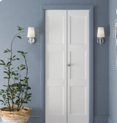
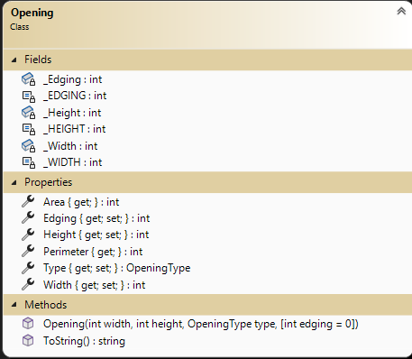
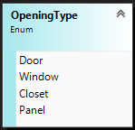
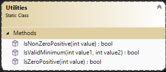

# OOP Training

> This is the first of a set of exercises that follow the evolution of a program to manage renovation projects. This set is cumulative and will build upon previous exercises.

## Overview

Your task is to generate a set of simple data types to represent the primary objects for managing renovation projects.

For this exercise, place all the required property data types in the namespace `RenoSystem` and ensure that they are `public`. Create your project as a **class library** (.NET Core 8). You have been supplied a Unit Tests project that will inform you if your work will meet specifications. **Ensure you follow the given class diagrams for the Unit Tests to work.**

### General Validation Rules

All validation is to be performed by throwing exceptions. Here are some general requirements.

- Exceptions must have meaningful error messages with keywords (ex: positive, minimum).
- Use `ArgumentException()` for parameter value errors.
- Error messages must include details about the limits for acceptable values.
- Measurements must always be positive and non-zero numbers. Measurements are to be in whole number increments (eg: 254) (all measures are in metric centimeters).
- All string information must contain text. Null, empty, and plain white-space text is not allowed. Sanitize your strings by trimming the leading and trailing whitespace.
- Use constants for minimum values.

### Unit Testing Code 

Unit testing code has been provided for you and can be located in the zip file in this folder. The zip file is called: RenoUnitTestEx1.zip. Download the file; unzip the file; move the RenoUnitTestEx1 folder to your solution; add the unit test project to your solution. Depending on any additional instructions from your instructor, you may need to update the project reference dependency and using statements.

### The `Opening`

Openings cover a variety of types such as windows, doors, panels which hide items such as entertainment electronics, and closets. The following is opening information:

- **Width** (e.g.: "110 cm") - Identifies the phyiscal size of the opening.
- **Height** (e.g: "230 cm") - Identifies the phyiscal size of the opening.
- **Edging** (e.g. "12 cm") - Identifies the width of any decorative edging.
- **Type** - Value that represents the type of this opening.
- **Area** - Value of the Opening area (width * height)
- **Perimeter** - Value of the distance around the Opening ((width + height) * 2)

Openings usually are framed but not necessarily such as basement windows. Openings width and height are the phyiscal size not the size of the item in the opening. Example, a door has a frame and the door. This is positioned within the opening and shimmed to fit correctly. Each opening may or may not have decorative edging. 

 You will need a greedy constructor for this class. Properties getters and setters are public. All data validation is to be placed within the properties.Type can be auto-impemented (no validation). Some properties only have a getter, because they calculate their values based on the state of the Opening. **Read-Only calculated properties are not to store data.** Create an overloaded .ToString() method for the class to display all the instance values in a comma separated value string (value order must match constructor parameter list).

Note the following:

- Minimum Width is 50 cm. 
- Minimum Height is 120 cm.
- A opening does not need an edging. Though a measurement is usually a positive non-zero value, Edging is special and can be zero (0).
- Minimum Edging if present (non-zero) is 10 cm.
### The `OpeningType`

Openings come in various structural types. Initially, we will consider only 4 types of openings: Door, Window, Closet and Panel. Even though other common openings could be for electical outlets, light switches and recess lighting; they are not physical structural openings.

### The `Utilities`

Create a public static class called `Utilities`. This class will have public static methods which **must** be used to do value testing in your Opening class.

1. Create a method that will validate a numeric value to be a non-zero positive (`IsNonZeroPositive`). 
2. 1. Create a method that will validate a numeric value to be a positive, can be zero (`IsZeroPositive`). 
3. Create a method that will validate a numeric value is equal to or above a given second value which is the minimum value. (`IsValidMinimum`)

### The `Unit Tests`

A unit testing project called `RenoUnitTestsEx1` has been supplied for this exercise. Add it to your solution. The tests have been commented out. As you code items in your class you can uncomment the appropriate unit test to evaluate your code. There is a separate unit test class for each of your classes. Check the unit test for the type of exception that is expected to be thrown. The unit tests have been divided into class components.

----

## Evaluation

> ***NOTE:** Your code **must** compile. Solutions that do not compile will receive an automatic mark of zero (0).*
> 
> If you are unable to get a portion of the assignment to compile or work, you should:
> - Comment out the  portion of code
> - Identify the reason for the commented portion (such *as does not compile* or *does not work cause an abort*)

Your assignment will be marked based upon the following weights. See the [general rubric](../../README.md#generalized-marking-rubric) for details.

| Earned | Weight | Deliverable/Requirement | Comments |
| ---- | ----- | --------- | ------- |
|  | 5 | Opening |   |
|  | 1 | OpeningType |   |
|  | 4 | Utility methods (reusable validation methods) |   |
|  | -4 | Other concerns and penalities (Examples but not limited to: RenoSystem does not compile/run;Unit Testing does not compile/run; commits do not reflect reflect incremental development; unstructure code, other instuctor requirements; ...) max -4 |   |
| ---- | ----- | --------- | ------- |
|  | **10** | **Total ** |    |

----
[Return to exercises](../README.md)
