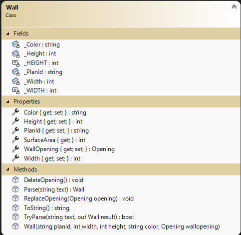
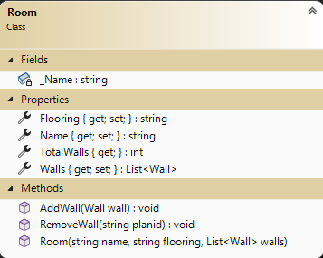

# OOP Training

> This is the next of a set of exercises that follow the evolution of a program to manage renovation projects. This set is cumulative and will build upon previous exercises.

## Overview

Your task is to generate a set of simple data types to represent the primary objects for managing renovation projects.

For this exercise, place all the required property data types in the namespace `RenoSystem` and ensure that they are `public`. Create your project as a **class library** (.NET Core 8). You have been supplied a Unit Tests project that will inform you if your work will meet specifications. **Ensure you follow the given class diagrams for the Unit Tests to work.**

### General Validation Rules

All validation is to be performed by throwing exceptions. Here are some general requirements.

- Exceptions must have meaningful error messages with keywords (ex: positive, minimum).
- Use `ArgumentException()` for parameter value errors.
- Error messages must include details about the limits for acceptable values.
- Measurements must always be positive and non-zero numbers. Measurements are to be in whole number increments (eg: 254) (all measures are in metric centimeters).
- All string information must contain text. Null, empty, and plain white-space text is not allowed. Sanitize your strings by trimming the leading and trailing whitespace.
- Use constants for minimum values.

### The `Wall` **Supplied Class DO NOT ALTER**

Walls are the basic components of the house. Walls will be rectangles and have up to one opening for the purpose of this set of exercises (for simplicity). We need to track the wall's:

- **PlanId** (unique string to identify wall during renovation)
- **Width** (in centimeters e.g.: "480"), 
- **Height** (in centimeters e.g.: "240"), 
- **Color** (e.g.: Ivory White),  
- **WallOpening** (e.g.: door, window, closet, panel), and 
- **SurfaceArea** - Value of the Wall area (width * height) minus the Opening area (if present)
  
  This class has been coded for you. You do not need to alter the code that has been supplied. 

Note the following:

- Minimum Width is 26 cm. 
- Minimum Height is 100 cm.
- The total area (width X height) of an opening in the wall must be less than 90% of the wall area. The 10% represents the need for structural framing of the openings. 
- A wall does not need to have an opening (nullable instance)

### The `Wall` ** Extension coding required**

**Extend** the `Wall` class by adding the following two methods.

- Add **`Parse`** and **`TryParse`** methods to instantiate a Wall from a string. The string's format is expected to match the formatting of the `ToString()` method.
  - In the `Parse` method, throw a [`FormatException`](https://docs.microsoft.com/dotnet/api/system.formatexception?view=net-5.0) if the supplied string does not match one of the expected formats (wall with no opening or wall with an opening).
  - In the `TryParse` method, explicitly return a `bool` indicating if the parsing was successful. The parameters for this method are to be a `string` and an `out` parameter for the `Wall` type.

### The `Room` **Coding required**

A Room is a set of walls with or without openings. A Room represents an distinct area of a residence. Rooms will normally have 4 or more walls but may have as little as one wall (open layout plan). The Room must at minimum have an identifier (Name) when created. New walls are added to the room one-by-one. The collection of Walls will have a `private set` property and a public `get`. Create a behaviour called `AddWall` that will receive a wall instance to add to the Walls collection. Validate that the wall `planid` is unique to the wall collection. Create a behaviour called `RemoveWall` that will receive a `planid` to remove the wall from the Walls collection.  Other properties have public mutators and accessors. The Room will track:

- **Name** - This identifies the Room. Cannot not be null.
- **Flooring** - This identifies the material of the floor such as tile, carpet, hardwood, etc. Can be null.
- **Walls** - This is the collection of walls for the Room.
- **TotalWalls** - Returns the number of walls for this room in the List&lt;Wall&gt; collection.

## Create Unit testing methods

 Create a unit testing project (.Net Core 8.0) called `RenoUnitTestsEx2` for this exercise. Add it to your solution. Create a class called `Room_Should` to hold your unit test code. Add a reference to your RenoSystem project to this project. The following table indicates the unit test cases to create. Unit Test names are left up to you. The required tests are outlined in the following table. You are to use NuGet FluentAssertions package within the xUnit testing project.

#### Unit Tests

 | Class item | Success/Fail | Specifications |
| ---- | --------- | ------------------- |
| Room  | Success | A room was successfully created with an name with no wall collection.   |
| Room  | Success | A room was successfully created with an name with a wall collection. (At least 3 walls in collection)  |
| Room  | Fail | There is no name supplied. Use ArgumentNullExpection().   |
| Room Name  | Success | Able to change the room name.  |
| Room Name  | Fail | There is no name supplied. Use ArgumentNullExpection().   |
| AddWall  | Success | Adds a wall to the Room. First_Wall.  |
| AddWall  | Success | Adds another wall to the Room. After_First_Wall.  |
| AddWall  | Fail | There is no wall instance supplied. Use ArgumentNullExpection(). Message must contain `Wall required`. Your assert must check the message.   |
| AddWall  | Fail | Adding a wall where planid already exists for the room. Use ArgumentExpection(). Include planid in the exception message and check for it within the assert.|  
| RemoveWall  | Success | Remaining walls order has not change. Wall removed.  | 
| RemoveWall  | Fail | There is no planid supplied. Use ArgumentNullExpection(). Message must contain the `Plan Id required` . Your assert must check the message. | 
| RemoveWall  | Fail | PlanId was not found. Use ArgumentExpection(). Message must contain Plain id. | 

----

## Evaluation

> ***NOTE:** Your code **must** compile. Solutions that do not compile will receive an automatic mark of zero (0).*
> 
> If you are unable to get a portion of the assignment to compile or work, you should:
> - Comment out the  portion of code
> - Identify the reason for the commented portion (such *as does not compile* or *does not work cause an abort*)

Your assignment will be marked based upon the following weights. See the [general rubric](../../README.md#generalized-marking-rubric) for details.

| Earned | Weight | Deliverable/Requirement | Comments |
| ---- | ----- | --------- | ------- |
|  | 3 | Wall |  |
|  | 5 | Room |   |
|  | 10 | xUnit Testing |   |
|  | -4 | Other concerns and penalities (Examples but not linited to: code does not compile/run; commits do not reflect incremental development; other instuctor requirements; ...) max -4 |   |
| ---- | ----- | --------- | ------- |
|  | **18** | **Total ** |    |

----
[Return to exercises](../README.md)
